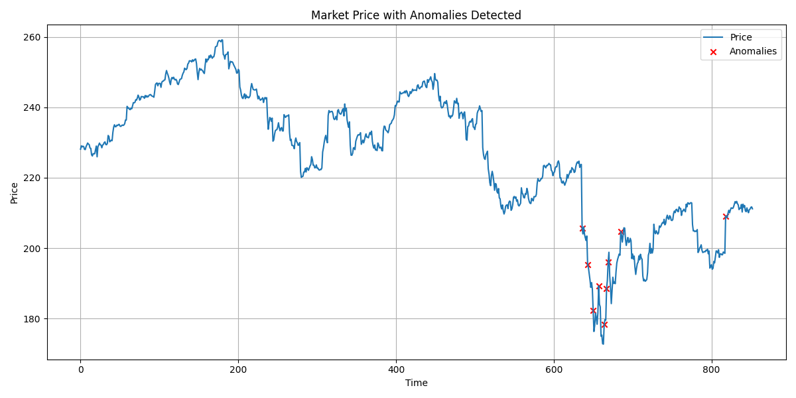

# QuantSecGuard readme

This readme will outline how to use this QuantSecGuard tool, and run through how the code behind the tool works.

***What is this tool?***

The goal of this project is to detect anomalous trading patterns using ML for quant and financial security use cases. It uses Isolation Forest and feature engineering from market data to identify these outliers, and outputs charts and anomaly tables. 

This tool can be used for market surveillance, fraud detection and strategy debugging.

A sample output of this tool can be seen below, displaying the last 6 months of market data for Apple (AAPL), with the anomalies detected represented as red crosses.

*File Structure:*
- *QuantSecGuard*
  - *src*
    - *data_loader.py*
    - *feature_engineering.py*
    - *model.py*
    - *visualise.py*
  - *main.py*
  - *readme.md*# QuantSecGuard

